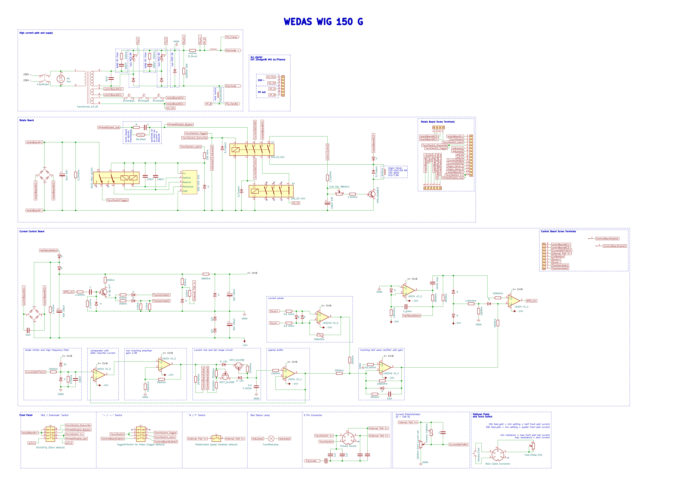

# wedasWig150G
Reverse engineered schematic for Wedas Wig 150G TIG WELDER.
Some diodes in the schematic could be Zener-diodes.

<h1>images</h1>
<h2>front</h2>

<h2>back</h2>

<h2>front</h2>

<h2>specifications</h2>

<h2>schematic preview</h2>

